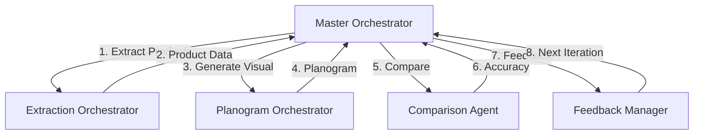

# Planogram System Analysis - Detailed Breakdown

## 1. Planogram Creation Stages

The planogram is created at **Step 2** of each iteration in the master orchestrator's main loop:

```python
# Step 1: Extract products from image
extraction_result = await self.extraction_orchestrator.extract_with_cumulative_learning(...)

# Step 2: Generate planogram from extraction
planogram_result = await self.planogram_orchestrator.generate_for_agent_iteration(
    agent_number=iteration,
    extraction_result=extraction_result,
    structure_context=structure_context,
    abstraction_level="product_view",
    original_image=images['enhanced']
)

# Step 3: Compare planogram to original image
comparison_result = await self.comparison_agent.compare_image_vs_planogram(...)

# Step 4: Calculate accuracy
accuracy_analysis = self.feedback_manager.analyze_accuracy_with_failure_areas(...)
```

### Detailed Flow:
1. **Extraction Phase**: Products are extracted from the image using AI vision models
2. **Planogram Generation**: The extracted product data is converted to a visual planogram
3. **Validation Phase**: The planogram is compared back to the original image
4. **Feedback Loop**: Accuracy is calculated and used to improve next iteration

## 2. Planogram Output Formats

The system generates planograms in **three formats**:

### A. SVG Format (Primary)
```xml
<svg width="800" height="600">
  <rect x="10" y="100" width="80" height="50" 
        fill="#3b82f6" stroke="#333" rx="3"/>
  <text x="13" y="120" font-size="11" font-weight="bold">Product Name</text>
  <text x="13" y="135" font-size="9">Brand | £2.99</text>
</svg>
```
- Used for visual display in the UI
- Scalable and lightweight
- Generated by `PlanogramRenderer.generate_svg_from_extractions()`

### B. Canvas/Fabric.js JavaScript
```javascript
const PlanogramData = {
    planogramId: "uuid",
    shelfCount: 4,
    totalWidthCm: 250,
    shelves: [{
        shelf_number: 1,
        elements: [{
            type: "product",
            name: "Coca Cola",
            facings: 3,
            confidence_color: "#22c55e"
        }]
    }]
};
```
- Interactive planogram for web display
- Supports tooltips and animations
- Generated by `PlanogramRenderer.generate_canvas_javascript()`

### C. Pydantic Models (Internal)
```python
VisualPlanogram(
    planogram_id="...",
    shelf_count=4,
    total_products=127,
    total_facings=245,
    space_utilization=85.3,
    shelves=[ShelfLine(...)]
)
```
- Used for internal data processing
- Type-safe and validated
- Defined in `src/planogram/models.py`

## 3. Planogram Data Sources

The planogram receives **non-visual** data from the extraction:

### Input Data Structure:
```python
ExtractionResult(
    products=[
        ProductExtraction(
            brand="Coca Cola",
            name="Original 330ml",
            price=1.29,
            position=Position(
                shelf_number=2,
                position_on_shelf=5,
                facing_count=3
            ),
            extraction_confidence=0.92
        )
    ],
    structure=ShelfStructure(
        shelf_count=4,
        estimated_width_meters=2.5,
        products_per_shelf_estimate=30
    )
)
```

### Key Information Used:
- **Product Details**: Brand, name, price
- **Position Data**: Shelf number, horizontal position, facing count
- **Shelf Structure**: Total shelves, width, expected capacity
- **Confidence Scores**: Per-product extraction confidence

The planogram generator **does not receive visual information** - it creates a visual representation from structured data.

## 4. Comparison Prompts and Validation

### Primary Comparison Prompt (from `ImageComparisonAgent`):
```python
"""
Analyze this retail shelf image and compare it to the following planogram description:

PLANOGRAM DESCRIPTION:
Shelf 1: Position 1: Coca Cola Original (3 facings), Position 2: Pepsi Max (2 facings)...

Please identify:
1. MATCHES: Products that are correctly positioned according to the planogram
2. MISMATCHES: Products in wrong positions or incorrectly identified
3. MISSING: Products in the planogram but not visible in the image
4. EXTRA: Products visible in the image but not in the planogram

For each product, provide:
- Shelf number (counting from top)
- Position on shelf (counting from left)
- Product name/brand
- Confidence score (0-1)
- Any issues or discrepancies
"""
```

The comparison uses **GPT-4 Vision** to analyze:
- Original shelf image (visual)
- Planogram description (text)
- Returns structured comparison data

## 5. Orchestrator Architecture

### Three-Level Orchestration:

```
MasterOrchestrator (Top Level)
├── ExtractionOrchestrator (Products)
├── PlanogramOrchestrator (Visualization)
└── Components:
    ├── FeedbackManager
    ├── ComparisonAgent
    ├── StateTracker
    └── SmartIterationManager
```

### A. Master Orchestrator
**Purpose**: Top-level control of the entire extraction pipeline
- Manages iteration loop (1-5 iterations)
- Coordinates all sub-orchestrators
- Tracks overall progress and accuracy
- Handles queue items and state management
- Makes decisions about continuing/stopping

**Key Methods**:
- `achieve_target_accuracy()`: Main iteration loop
- `_trigger_human_evaluation()`: Escalates if needed
- Manages cost tracking and budget limits

### B. Extraction Orchestrator
**Purpose**: Manages the actual product extraction from images
- Controls cumulative learning between iterations
- Selects appropriate AI models per stage
- Implements shelf-by-shelf extraction
- Manages locked positions and focus areas

**Key Features**:
- Model configuration support
- Temperature control
- Stage-specific model selection
- Cumulative context building

### C. Planogram Orchestrator
**Purpose**: Converts extraction data to visual planograms
- Generates planograms for each iteration
- Supports multiple abstraction levels
- Evaluates planogram quality
- Creates comparison sets

**Abstraction Levels**:
1. **Product View**: Individual products with full details
2. **Brand View**: Grouped by brand blocks
3. **SKU View**: Individual SKU facings

## 6. Interaction Flow



### Detailed Interaction:
1. **Master** initiates extraction for iteration N
2. **Extraction** returns structured product data
3. **Master** passes data to planogram generation
4. **Planogram** creates visual representation
5. **Master** sends both image and planogram to comparison
6. **Comparison** calculates accuracy using vision AI
7. **Feedback** identifies areas for improvement
8. **Master** decides whether to continue iterating

## 7. Critical Analysis & Improvement Recommendations

### Current Strengths:
1. **Iterative Refinement**: Multiple passes improve accuracy
2. **Cumulative Learning**: Each iteration builds on previous
3. **Multiple Representations**: SVG, Canvas, and structured data
4. **Confidence Tracking**: Per-product confidence scores

### Critical Weaknesses:

#### 1. **Spatial Accuracy Loss**
The system converts visual positions to discrete slots:
- Image: Continuous pixel coordinates
- Extraction: Discrete position numbers (1, 2, 3...)
- Planogram: Fixed-width product blocks

**Impact**: Products may appear in wrong positions due to quantization

#### 2. **No Visual Feature Preservation**
Product appearance is not captured:
- No color information
- No package shape/size
- No visual distinctiveness
- Generic rectangular blocks

**Impact**: Planogram doesn't visually match reality

#### 3. **Limited Validation Loop**
The comparison converts planogram back to text:
- Original: Image → Text → Planogram → Text → Comparison
- Better: Image → Planogram (visual) → Direct visual comparison

#### 4. **Fixed Layout Assumptions**
- Assumes uniform product widths (8cm)
- Assumes regular shelf spacing
- No support for irregular displays

### Recommended Improvements:

#### 1. **Visual Feature Extraction**
```python
ProductExtraction(
    # Existing fields...
    visual_features={
        "dominant_color": "#FF0000",
        "package_type": "can",
        "aspect_ratio": 0.5,
        "size_category": "small",
        "visual_embedding": [0.1, 0.2, ...] # From CLIP/ViT
    }
)
```

#### 2. **Continuous Position Tracking**
```python
Position(
    shelf_number=2,
    x_percentage=0.234,  # 23.4% from left
    width_percentage=0.045,  # 4.5% of shelf width
    bounding_box={
        "x1": 234, "y1": 456,
        "x2": 290, "y2": 567
    }
)
```

#### 3. **Direct Visual Comparison**
Instead of text description, generate actual image:
- Render planogram to PNG at same resolution
- Use image-to-image comparison models
- Calculate visual similarity metrics (SSIM, perceptual hash)

#### 4. **Adaptive Layout Engine**
```python
class AdaptiveLayoutEngine:
    def analyze_shelf_image(self, image):
        # Detect actual shelf boundaries
        # Measure product widths from image
        # Identify irregular spaces
        return ShelfGeometry(...)
    
    def generate_planogram(self, products, geometry):
        # Use actual measurements
        # Preserve relative positions
        # Handle irregular layouts
```

#### 5. **Multi-Modal Embeddings**
Combine visual and textual features:
```python
async def extract_with_multimodal(image):
    # Visual features from CLIP/ViT
    visual_embedding = await get_visual_embedding(image)
    
    # Text extraction from OCR
    text_features = await extract_text_regions(image)
    
    # Spatial relationships
    spatial_graph = await build_spatial_graph(image)
    
    return MultiModalExtraction(
        visual=visual_embedding,
        textual=text_features,
        spatial=spatial_graph
    )
```

#### 6. **Planogram Confidence Visualization**
Show uncertainty directly in the planogram:
- Color gradients for confidence
- Dotted borders for uncertain products
- Highlight problem areas
- Show alternative interpretations

#### 7. **Real-Time Feedback Integration**
During extraction, not after:
```python
async def interactive_extraction(image):
    initial_extraction = await extract_products(image)
    planogram = await generate_planogram(initial_extraction)
    
    # Show planogram overlaid on image
    overlay = create_overlay(image, planogram)
    
    # Get immediate feedback
    corrections = await get_ai_corrections(overlay)
    
    # Apply corrections in same iteration
    final_extraction = apply_corrections(initial_extraction, corrections)
```

### Implementation Priority:
1. **High**: Continuous position tracking (biggest accuracy gain)
2. **High**: Visual feature extraction (better matching)
3. **Medium**: Direct visual comparison (more accurate validation)
4. **Medium**: Adaptive layout engine (handle real-world variety)
5. **Low**: Multi-modal embeddings (future enhancement)

These improvements would create a more accurate, visually faithful planogram that better represents the actual shelf layout while maintaining the system's iterative refinement strengths.