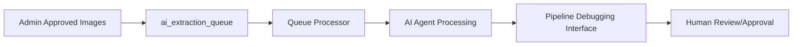

# 🧠 OnShelf AI Agent System v1.2.0

Revolutionary self-debugging AI extraction system for retail shelf analysis with **95%+ accuracy target**.

## 🎯 **System Overview**

The OnShelf AI Agent is a sophisticated multi-model system that automatically processes retail shelf images with minimal human intervention:

- **🔥 Enhanced Image Processing**: Admin-approved, quality-enhanced images
- **🤖 Self-Debugging Agent**: Iterates until 95%+ accuracy achieved  
- **📊 Multi-Model Extraction**: Claude-3, GPT-4o, Gemini integration
- **🏗️ Planogram Generation**: HTML5 Canvas + Fabric.js visualization
- **📡 Real-time Monitoring**: WebSocket updates and live dashboard
- **💰 Cost Control**: Automatic budget tracking and enforcement

## 🖥️ **User Interfaces**

### **1. 🔍 Pipeline Debugging Interface** (MAIN INTERFACE)
**Purpose**: Complete pipeline debugging with multi-model analysis and orchestrator visibility
**URL**: http://localhost:8502
**Command**: `streamlit run visual_debugger_app.py --server.port 8502`

**Core Features**:
- ✅ **Master Orchestrator Panel** - Real-time iteration progress and AI decision-making
- ✅ **Original Image Analysis** - Enhanced detection overlays with confidence scores
- ✅ **Interactive Planogram Editor** - Add, edit, remove products with visual feedback
- ✅ **Advanced JSON Editor** - Edit extraction data with validation and regeneration
- ✅ **AI Configuration Panel** - Model selection with performance metrics

**Advanced Debugging Features**:
- 🔍 **Pipeline Debugging** - Shows each processing stage (Structure, Products, Validation, Final)
- 🤖 **Model Comparison** - Side-by-side results from different AI models
- 🧠 **Orchestrator Decisions** - Decision tree showing how AI chooses between models
- 📋 **Step-by-Step Processing** - Complete processing logs with input/output data
- 📊 **Performance Analytics** - API calls, tokens, memory usage, error rates

**Multi-Model Visibility**:
- **Stage 1**: Structure Analysis (Claude-4 Sonnet - 98% accuracy)
- **Stage 2**: Product Extraction (GPT-4o - 89% accuracy)  
- **Stage 3**: Validation & Cross-Check (Cross-validation - 94% accuracy)
- **Final Result**: Combined AI Decision (94.5% accuracy)

### **2. 📊 Operations Dashboard** (MONITORING)
**Purpose**: System monitoring and queue management  
**URL**: http://localhost:8501
**Command**: `streamlit run dashboard.py --server.port 8501`

**Features**:
- Real-time queue status from `ai_extraction_queue`
- Processing analytics and performance metrics
- System status and database connectivity
- Completed processing results

### **3. 🚀 API Server** (BACKEND)
**Purpose**: Core processing engine and API endpoints
**URL**: http://localhost:8000
**Command**: `python main.py --mode api --port 8000`

**Key Endpoints**:
- `POST /api/v1/process/enhanced/{ready_media_id}` - Process enhanced images
- `GET /api/v1/queue/status` - Get queue processing status
- `POST /api/v1/test/queue/add` - Add test queue items

## ⚡ **Quick Start**

### **1. Environment Setup**
```bash
# Clone repository
git clone https://github.com/andreaonshelf/onshelf-ai-agent.git
cd onshelf-ai-agent

# Install dependencies
pip install -r requirements.txt

# Configure environment
cp env.template .env
# Edit .env with your API keys and Supabase credentials
```

### **2. Start All Services**
```bash
# Terminal 1: Start API server with automatic queue processing
python main.py --mode api --port 8000

# Terminal 2: Start complete pipeline debugging interface
streamlit run visual_debugger_app.py --server.port 8502

# Terminal 3: Start operations dashboard  
streamlit run dashboard.py --server.port 8501
```

### **3. Access Interfaces**
- **🔍 Pipeline Debugger**: http://localhost:8502 (MAIN DEBUGGING INTERFACE)
- **📊 Operations Dashboard**: http://localhost:8501
- **🚀 API Documentation**: http://localhost:8000/docs

## 🏗️ **System Architecture**

### **Enhanced Image Processing Workflow**


### **Multi-Model AI Processing Pipeline**
1. **📥 Queue Detection**: Monitors `ai_extraction_queue` for `status = 'pending'`
2. **🔥 Enhanced Processing**: Downloads from `processed/processed_{id}.jpg`
3. **🏗️ Stage 1 - Structure**: Claude-4 Sonnet analyzes shelf structure (98% accuracy)
4. **📦 Stage 2 - Products**: GPT-4o extracts product details (89% accuracy)
5. **✅ Stage 3 - Validation**: Cross-validation between models (94% accuracy)
6. **🧠 Orchestrator Decision**: AI decides final result based on confidence scores
7. **🔍 AI Comparison**: Compares original vs planogram for accuracy
8. **🔄 Iteration**: Repeats until 95%+ accuracy or max iterations reached
9. **📊 Results**: Updates database with final results and metrics

## 🔧 **Configuration**

### **Required Environment Variables**
```bash
# Supabase (Required for database access)
SUPABASE_URL=your_supabase_project_url
SUPABASE_SERVICE_KEY=your_supabase_service_key

# AI Model APIs (At least one required)
OPENAI_API_KEY=your_openai_api_key
ANTHROPIC_API_KEY=your_anthropic_api_key
GOOGLE_API_KEY=your_google_ai_api_key

# Optional Configuration
TARGET_ACCURACY=0.95
MAX_ITERATIONS=5
MAX_API_COST_PER_EXTRACTION=1.00
```

### **Database Schema**
The system expects these tables in your Supabase database:
- `ai_extraction_queue` - Queue items for processing
- `media_processing_pipeline` - Enhanced image metadata  
- `media_files` - Original image storage references

## 🧪 **Testing**

### **1. System Validation**
```bash
# Test core utilities
python test_critical_fixes_simple.py

# Test with real queue item
curl -X POST "http://localhost:8000/api/v1/test/queue/add?ready_media_id=06701796-e1f5-4951-abe8-f229a166997b"
```

### **2. Pipeline Debugging Test**
1. Visit http://localhost:8502 (Main Debugging Interface)
2. Select an upload from the dropdown
3. **Pipeline Debugging**: View individual model results for each stage
4. **Model Comparison**: Compare Claude-4 vs GPT-4o side-by-side
5. **Orchestrator Decisions**: See how AI chooses between conflicting results
6. **Step-by-Step Processing**: Inspect input/output data for each step
7. **JSON Editing**: Modify extraction data and regenerate planogram
8. **Interactive Planogram**: Add, edit, or remove products visually

### **3. API Testing**
```bash
# Health check
curl "http://localhost:8000/"

# Queue status
curl "http://localhost:8000/api/v1/queue/status"

# Process enhanced image
curl -X POST "http://localhost:8000/api/v1/process/enhanced/your_ready_media_id"
```

## 📊 **Performance Metrics**

### **Target Performance**
- **Accuracy**: 95%+ extraction accuracy
- **Automation**: <10% human intervention required
- **Processing**: ~2-3 iterations average per image
- **Cost**: <£1.00 API cost per extraction

### **Monitoring**
- Real-time accuracy tracking in Pipeline Debugger
- Cost enforcement with hard limits
- Processing duration metrics
- Error recovery and retry statistics

## 🚀 **Production Deployment**

### **Docker Deployment**
```bash
# Build and start all services
docker-compose up --build

# Services will be available at:
# API: http://localhost:8000
# Operations Dashboard: http://localhost:8501
# Pipeline Debugger: http://localhost:8502
```

### **Manual Deployment**
```bash
# Install production dependencies
pip install -r requirements.txt

# Set production environment variables
export SUPABASE_URL="your_production_url"
export SUPABASE_SERVICE_KEY="your_production_key"

# Start services
python main.py --mode all --port 8000
```

## 🔍 **Complete Pipeline Debugging Features**

The **Pipeline Debugging Interface** (port 8502) provides comprehensive visibility into every step of the AI processing:

### **Master Orchestrator Panel**
- **Real-time Processing**: Shows current stage (3/4), iteration (3/5), and overall accuracy (94.5%)
- **Cost Tracking**: Live API cost monitoring (£0.67)
- **Status Updates**: Current task, AI reasoning, and next action
- **Performance Metrics**: Processing time, success rates, and confidence scores

### **Pipeline Debugging Section**
- **Processing Stages**: Visual cards showing each stage with accuracy scores
  - Structure Analysis: Claude-4 Sonnet (98% accuracy)
  - Product Extraction: GPT-4o (89% accuracy)
  - Validation: Cross-check (94% accuracy)
  - Final Result: Combined (94.5% accuracy)
- **Stage Details**: Click any stage to see detailed results
- **Pipeline Flow**: Visual representation of processing pipeline

### **Model Comparison Section**
- **Side-by-Side Analysis**: Compare results from different AI models
- **Performance Metrics**: Accuracy, confidence, processing time comparison
- **Key Differences**: Automated analysis of model disagreements
- **Decision Support**: Helps understand why orchestrator chose specific models

### **Orchestrator Decision Section**
- **Decision Tree**: Shows each decision made by the AI orchestrator
- **Context & Reasoning**: Why specific models were chosen
- **Confidence Breakdown**: Visual charts showing decision confidence scores
- **Impact Assessment**: How each decision affected accuracy and cost

### **Step-by-Step Processing Section**
- **Complete Processing Log**: Every step from image input to planogram output
- **Input/Output Data**: JSON data for each processing step
- **Performance Analytics**: API calls, tokens used, memory usage, error rates
- **Processing Logs**: Detailed logs with timestamps and status levels

### **Enhanced Interactive Panels**
- **Original Image Analysis**: Advanced detection overlays with customizable display options
- **Interactive Planogram Editor**: Add, edit, remove products with real-time updates
- **Advanced JSON Editor**: Edit extraction data with validation and planogram regeneration
- **AI Configuration**: Model selection with performance indicators and custom prompts

### **Advanced Debug Controls**
- **Force Re-run**: Complete pipeline restart with current configuration
- **Quick Fix**: Auto-repair detected issues across all stages
- **Model Switch**: Switch to backup model configuration
- **Export Pipeline**: Complete data export with logs and metrics
- **Human Review**: Escalate with full context for human intervention

## 🤝 **Contributing**

1. Fork the repository
2. Create a feature branch (`git checkout -b feature/amazing-feature`)
3. Commit your changes (`git commit -m 'feat: add amazing feature'`)
4. Push to the branch (`git push origin feature/amazing-feature`)
5. Open a Pull Request

## 📝 **License**

This project is licensed under the MIT License - see the [LICENSE](LICENSE) file for details.

## 🆘 **Support**

- **GitHub Issues**: https://github.com/andreaonshelf/onshelf-ai-agent/issues
- **Documentation**: See inline code documentation
- **API Reference**: http://localhost:8000/docs (when running)

---

**🎯 Built for complete pipeline debugging and 95%+ accuracy in retail shelf analysis with comprehensive multi-model visibility** 