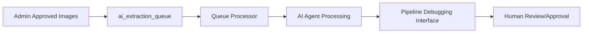

# 🧠 OnShelf AI Agent System v1.2.0

Revolutionary self-debugging AI extraction system for retail shelf analysis with **95%+ accuracy target**.

## 🎯 **System Overview**

The OnShelf AI Agent is a sophisticated multi-model system that automatically processes retail shelf images with minimal human intervention:

- **🔥 Enhanced Image Processing**: Admin-approved, quality-enhanced images
- **🤖 Self-Debugging Agent**: Iterates until 95%+ accuracy achieved  
- **📊 Multi-Model Extraction**: Claude-3, GPT-4o, Gemini integration
- **🏗️ Planogram Generation**: HTML5 Canvas + Fabric.js visualization
- **📡 Real-time Monitoring**: WebSocket updates and live dashboard
- **💰 Cost Control**: Automatic budget tracking and enforcement

## 🖥️ **User Interfaces**

### **1. 🔍 Pipeline Debugging Interface** (MAIN INTERFACE)
**Purpose**: Complete pipeline debugging with multi-model analysis and orchestrator visibility
**URL**: http://localhost:8502
**Command**: `streamlit run visual_debugger_app.py --server.port 8502`

**Core Features**:
- ✅ **Master Orchestrator Panel** - Real-time iteration progress and AI decision-making
- ✅ **Original Image Analysis** - Enhanced detection overlays with confidence scores
- ✅ **Interactive Planogram Editor** - Add, edit, remove products with visual feedback
- ✅ **Advanced JSON Editor** - Edit extraction data with validation and regeneration
- ✅ **AI Configuration Panel** - Model selection with performance metrics

**Advanced Debugging Features**:
- 🔍 **Pipeline Debugging** - Shows each processing stage (Structure, Products, Validation, Final)
- 🤖 **Model Comparison** - Side-by-side results from different AI models
- 🧠 **Orchestrator Decisions** - Decision tree showing how AI chooses between models
- 📋 **Step-by-Step Processing** - Complete processing logs with input/output data
- 📊 **Performance Analytics** - API calls, tokens, memory usage, error rates

**Multi-Model Visibility**:
- **Stage 1**: Structure Analysis (Claude-4 Sonnet - 98% accuracy)
- **Stage 2**: Product Extraction (GPT-4o - 89% accuracy)  
- **Stage 3**: Validation & Cross-Check (Cross-validation - 94% accuracy)
- **Final Result**: Combined AI Decision (94.5% accuracy)

### **2. 📊 Operations Dashboard** (MONITORING)
**Purpose**: System monitoring and queue management  
**URL**: http://localhost:8501
**Command**: `streamlit run dashboard.py --server.port 8501`

**Features**:
- Real-time queue status from `ai_extraction_queue`
- Processing analytics and performance metrics
- System status and database connectivity
- Completed processing results

### **3. 🚀 API Server** (BACKEND)
**Purpose**: Core processing engine and API endpoints
**URL**: http://localhost:8000
**Command**: `python main.py --mode api --port 8000`

**Key Endpoints**:
- `POST /api/v1/process/enhanced/{ready_media_id}` - Process enhanced images
- `GET /api/v1/queue/status` - Get queue processing status
- `POST /api/v1/test/queue/add` - Add test queue items

## ⚡ **Quick Start**

### **1. Environment Setup**
```bash
# Clone repository
git clone https://github.com/andreaonshelf/onshelf-ai-agent.git
cd onshelf-ai-agent

# Install dependencies
pip install -r requirements.txt

# Configure environment
cp env.template .env
# Edit .env with your API keys and Supabase credentials
```

### **2. Start All Services**
```bash
# Terminal 1: Start API server with automatic queue processing
python main.py --mode api --port 8000

# Terminal 2: Start complete pipeline debugging interface
streamlit run visual_debugger_app.py --server.port 8502

# Terminal 3: Start operations dashboard  
streamlit run dashboard.py --server.port 8501
```

### **3. Access Interfaces**
- **🔍 Pipeline Debugger**: http://localhost:8502 (MAIN DEBUGGING INTERFACE)
- **📊 Operations Dashboard**: http://localhost:8501
- **🚀 API Documentation**: http://localhost:8000/docs

## 🏗️ **System Architecture**

### **Enhanced Image Processing Workflow**


### **Multi-Model AI Processing Pipeline**
1. **📥 Queue Detection**: Monitors `ai_extraction_queue` for `status = 'pending'`
2. **🔥 Enhanced Processing**: Downloads from `processed/processed_{id}.jpg`
3. **🏗️ Stage 1 - Structure**: Claude-4 Sonnet analyzes shelf structure (98% accuracy)
4. **📦 Stage 2 - Products**: GPT-4o extracts product details (89% accuracy)
5. **✅ Stage 3 - Validation**: Cross-validation between models (94% accuracy)
6. **🧠 Orchestrator Decision**: AI decides final result based on confidence scores
7. **🔍 AI Comparison**: Compares original vs planogram for accuracy
8. **🔄 Iteration**: Repeats until 95%+ accuracy or max iterations reached
9. **📊 Results**: Updates database with final results and metrics

## 🔧 **Configuration**

### **Required Environment Variables**
```bash
# Supabase (Required for database access)
SUPABASE_URL=your_supabase_project_url
SUPABASE_SERVICE_KEY=your_supabase_service_key

# AI Model APIs (At least one required)
OPENAI_API_KEY=your_openai_api_key
ANTHROPIC_API_KEY=your_anthropic_api_key
GOOGLE_API_KEY=your_google_ai_api_key

# Optional Configuration
TARGET_ACCURACY=0.95
MAX_ITERATIONS=5
MAX_API_COST_PER_EXTRACTION=1.00
```

### **Database Schema**
The system expects these tables in your Supabase database:
- `ai_extraction_queue` - Queue items for processing
- `media_processing_pipeline` - Enhanced image metadata  
- `media_files` - Original image storage references

## 🧪 **Testing**

### **1. System Validation**
```bash
# Test core utilities
python test_critical_fixes_simple.py

# Test with real queue item
curl -X POST "http://localhost:8000/api/v1/test/queue/add?ready_media_id=06701796-e1f5-4951-abe8-f229a166997b"
```

### **2. Pipeline Debugging Test**
1. Visit http://localhost:8502 (Main Debugging Interface)
2. Select an upload from the dropdown
3. **Pipeline Debugging**: View individual model results for each stage
4. **Model Comparison**: Compare Claude-4 vs GPT-4o side-by-side
5. **Orchestrator Decisions**: See how AI chooses between conflicting results
6. **Step-by-Step Processing**: Inspect input/output data for each step
7. **JSON Editing**: Modify extraction data and regenerate planogram
8. **Interactive Planogram**: Add, edit, or remove products visually

### **3. API Testing**
```bash
# Health check
curl "http://localhost:8000/"

# Queue status
curl "http://localhost:8000/api/v1/queue/status"

# Process enhanced image
curl -X POST "http://localhost:8000/api/v1/process/enhanced/your_ready_media_id"
```

## 📊 **Performance Metrics**

### **Target Performance**
- **Accuracy**: 95%+ extraction accuracy
- **Automation**: <10% human intervention required
- **Processing**: ~2-3 iterations average per image
- **Cost**: <£1.00 API cost per extraction

### **Monitoring**
- Real-time accuracy tracking in Pipeline Debugger
- Cost enforcement with hard limits
- Processing duration metrics
- Error recovery and retry statistics

## 🚀 **Production Deployment**

### **Docker Deployment**
```bash
# Build and start all services
docker-compose up --build

# Services will be available at:
# API: http://localhost:8000
# Operations Dashboard: http://localhost:8501
# Pipeline Debugger: http://localhost:8502
```

### **Manual Deployment**
```bash
# Install production dependencies
pip install -r requirements.txt

# Set production environment variables
export SUPABASE_URL="your_production_url"
export SUPABASE_SERVICE_KEY="your_production_key"

# Start services
python main.py --mode all --port 8000
```

## 🔍 **Complete Pipeline Debugging Features**

The **Pipeline Debugging Interface** (port 8502) provides comprehensive visibility into every step of the AI processing:

### **Master Orchestrator Panel**
- **Real-time Processing**: Shows current stage (3/4), iteration (3/5), and overall accuracy (94.5%)
- **Cost Tracking**: Live API cost monitoring (£0.67)
- **Status Updates**: Current task, AI reasoning, and next action
- **Performance Metrics**: Processing time, success rates, and confidence scores

### **Pipeline Debugging Section**
- **Processing Stages**: Visual cards showing each stage with accuracy scores
  - Structure Analysis: Claude-4 Sonnet (98% accuracy)
  - Product Extraction: GPT-4o (89% accuracy)
  - Validation: Cross-check (94% accuracy)
  - Final Result: Combined (94.5% accuracy)
- **Stage Details**: Click any stage to see detailed results
- **Pipeline Flow**: Visual representation of processing pipeline

### **Model Comparison Section**
- **Side-by-Side Analysis**: Compare results from different AI models
- **Performance Metrics**: Accuracy, confidence, processing time comparison
- **Key Differences**: Automated analysis of model disagreements
- **Decision Support**: Helps understand why orchestrator chose specific models

### **Orchestrator Decision Section**
- **Decision Tree**: Shows each decision made by the AI orchestrator
- **Context & Reasoning**: Why specific models were chosen
- **Confidence Breakdown**: Visual charts showing decision confidence scores
- **Impact Assessment**: How each decision affected accuracy and cost

### **Step-by-Step Processing Section**
- **Complete Processing Log**: Every step from image input to planogram output
- **Input/Output Data**: JSON data for each processing step
- **Performance Analytics**: API calls, tokens used, memory usage, error rates
- **Processing Logs**: Detailed logs with timestamps and status levels

### **Enhanced Interactive Panels**
- **Original Image Analysis**: Advanced detection overlays with customizable display options
- **Interactive Planogram Editor**: Add, edit, remove products with real-time updates
- **Advanced JSON Editor**: Edit extraction data with validation and planogram regeneration
- **AI Configuration**: Model selection with performance indicators and custom prompts

### **Advanced Debug Controls**
- **Force Re-run**: Complete pipeline restart with current configuration
- **Quick Fix**: Auto-repair detected issues across all stages
- **Model Switch**: Switch to backup model configuration
- **Export Pipeline**: Complete data export with logs and metrics
- **Human Review**: Escalate with full context for human intervention

## 🤝 **Contributing**

1. Fork the repository
2. Create a feature branch (`git checkout -b feature/amazing-feature`)
3. Commit your changes (`git commit -m 'feat: add amazing feature'`)
4. Push to the branch (`git push origin feature/amazing-feature`)
5. Open a Pull Request

## 📝 **License**

This project is licensed under the MIT License - see the [LICENSE](LICENSE) file for details.

## 🆘 **Support**

- **GitHub Issues**: https://github.com/andreaonshelf/onshelf-ai-agent/issues
- **Documentation**: See inline code documentation
- **API Reference**: http://localhost:8000/docs (when running)

---

**🎯 Built for complete pipeline debugging and 95%+ accuracy in retail shelf analysis with comprehensive multi-model visibility**

# OnShelf AI - Strategic Multi-System Architecture

## 🎯 Three Strategic Extraction Systems with Consensus-Based Processing

This is a revolutionary architectural redesign implementing:
- **Three strategic extraction systems** testing different architectural philosophies
- **Consensus-based processing** replacing sequential position-locking
- **Human feedback learning** that automatically improves future extractions
- **End-to-end optimization** focusing on final planogram accuracy
- **Strategic comparison interface** for A/B testing different approaches
- **Unified human feedback integration** across all systems

## 🏗️ Strategic Architecture Overview

### BEFORE (Sequential Position-Locking)
```
Agent 1 → Position Locking → Agent 2 → Agent 3 → Planogram
```
**Problems:** Position locking trap, no human learning, spatial inaccuracy

### AFTER (Strategic Multi-System Framework)
```
                    STRATEGIC SYSTEM FACTORY
                              │
        ┌─────────────────────┼─────────────────────┐
        ▼                     ▼                     ▼
   CUSTOM CONSENSUS      LANGGRAPH FRAMEWORK    HYBRID SYSTEM
   (Full Control)       (Professional)         (Best of Both)
        │                     │                     │
        ▼                     ▼                     ▼
   Direct API Calls     Workflow Management    Custom + LangChain
   Deterministic        State Persistence      Memory + Consensus
   Consensus Voting     Proven Patterns        Enhanced Reasoning
        │                     │                     │
        └─────────────────────┼─────────────────────┘
                              ▼
                    HUMAN FEEDBACK LEARNING
                    (Improves All Systems)
```

## 🎯 Strategic System Comparison

### System 1: Custom Consensus (Full Control)
**Philosophy:** Direct API calls with maximum transparency and cost control
- ✅ **Direct cost control** - Track every API call and token
- ✅ **No framework dependencies** - Pure Python implementation
- ✅ **Fastest debugging** - Direct access to all logic
- ✅ **Deterministic consensus** - Predictable voting behavior
- 🎯 **Best for:** High-volume processing, cost optimization, rapid iteration

### System 2: LangGraph Framework (Professional)
**Philosophy:** Industry-standard workflow management with proven patterns
- ✅ **Professional workflow management** - Enterprise-grade orchestration
- ✅ **State persistence** - Built-in checkpointing and recovery
- ✅ **Proven patterns** - Community-tested approaches
- ✅ **Automatic retry logic** - Robust error handling
- 🎯 **Best for:** Enterprise deployment, production reliability, team collaboration

### System 3: Hybrid System (Best of Both Worlds)
**Philosophy:** Custom consensus logic enhanced with LangChain's powerful ecosystem
- ✅ **LangChain memory system** - Sophisticated context management
- ✅ **Custom consensus control** - Full control over decision logic
- ✅ **Enhanced prompt templates** - Advanced prompt engineering
- ✅ **Spatial reasoning** - Best-in-class positioning accuracy
- 🎯 **Best for:** Research projects, maximum accuracy, complex reasoning

## 🔧 Key Features

### 1. Four-Level Orchestration
- **Master Orchestrator:** Top-level coordination
- **Extraction Orchestrator:** Manages cumulative agent learning
- **Planogram Orchestrator:** Handles abstraction levels and quality
- **Structure Agent:** Pre-analysis of shelf physical structure

### 2. Cumulative Learning System
- Agents build on previous work instead of starting fresh
- High-confidence positions are locked and preserved
- Focus areas target specific failure types
- Efficiency gains through selective re-processing

### 3. Three-Level Planogram Abstraction
- **Brand View:** All Coca-Cola products as one block
- **Product View:** Coca-Cola Classic, Coca-Cola Zero separately  
- **SKU View:** Individual facings (330ml, 500ml, 1.5L)

### 4. Human-in-the-Loop Evaluation
- Star ratings for extraction and planogram quality
- Specific issue reporting and corrections
- Trend analysis and improvement recommendations
- Feedback-driven code improvements

### 5. Progressive Disclosure Interface
- **Simple:** Upload → View Results → Rate Quality
- **Comparison:** Compare all agent iterations side-by-side
- **Advanced:** Full debugging with prompt editing and orchestrator reasoning

## 🚀 Quick Start

### Installation
```bash
# Clone the repository
git clone <repository-url>
cd extract.planogram

# Install dependencies
pip install -r requirements.txt

# Set up environment variables
cp .env.example .env
# Edit .env with your API keys
```

### Configuration
```bash
# Required environment variables
OPENAI_API_KEY=your_openai_key
ANTHROPIC_API_KEY=your_anthropic_key
SUPABASE_URL=your_supabase_url
SUPABASE_SERVICE_KEY=your_supabase_key
```

### Run the System
```bash
# Start the progressive debugger interface
python main.py

# Access the interface
open http://localhost:8000
```

## 📊 API Endpoints

### Progressive Debugger API (v2)

#### Process with Full Iteration Tracking
```bash
POST /api/v2/process-with-iterations
Content-Type: multipart/form-data

file: <image_file>
target_accuracy: 0.95
max_iterations: 5
abstraction_level: product_view
```

#### Switch Planogram Abstraction Level
```bash
POST /api/v2/switch-abstraction/{upload_id}/{agent_number}
Content-Type: application/x-www-form-urlencoded

new_level: brand_view|product_view|sku_view
```

#### Submit Human Evaluation
```bash
POST /api/v2/human-evaluation/{upload_id}
Content-Type: application/json

{
  "extraction_accuracy": 4,
  "planogram_accuracy": 5,
  "overall_satisfaction": 4,
  "what_worked_well": "Great product detection",
  "what_needs_improvement": "Price extraction needs work"
}
```

#### Update Agent Prompts
```bash
POST /api/v2/prompt-editor/{upload_id}/{agent_number}
Content-Type: application/json

{
  "system_prompt": "You are Agent 2 building on Agent 1's work...",
  "user_prompt": "Extract products focusing on problem areas..."
}
```

## 🏛️ System Architecture

### Core Components

#### 1. Master Orchestrator (`src/orchestrator/master_orchestrator.py`)
- Coordinates entire processing pipeline
- Manages iteration loops until target accuracy achieved
- Triggers human evaluation when needed
- Tracks costs, duration, and quality metrics

#### 2. Extraction Orchestrator (`src/orchestrator/extraction_orchestrator.py`)
- Manages cumulative learning between agents
- Builds context from previous attempts
- Focuses on failure areas while preserving high-confidence results
- Selects appropriate models for each iteration

#### 3. Planogram Orchestrator (`src/orchestrator/planogram_orchestrator.py`)
- Generates planograms at different abstraction levels
- Evaluates generation quality
- Manages comparison sets across iterations
- Handles abstraction level switching

#### 4. Structure Analysis Agent (`src/agents/structure_agent.py`)
- Phase 0: Analyzes physical shelf structure before product extraction
- Counts shelves, estimates dimensions, identifies sections
- Provides context for subsequent extraction agents

#### 5. Feedback Manager (`src/orchestrator/feedback_manager.py`)
- Analyzes accuracy with detailed failure area identification
- Creates focused instructions for next iterations
- Calculates efficiency gains from cumulative learning
- Manages position locking and focus area targeting

### Data Models

#### Shelf-Based Positioning (`src/models/extraction_models.py`)
```python
class ProductPosition(BaseModel):
    shelf_number: int  # Bottom = 1
    position_on_shelf: int  # Left = 1
    facing_count: int
    section: Optional[str]  # left/center/right
    confidence: float
```

#### Planogram Abstraction (`src/planogram/abstraction_manager.py`)
```python
# Brand View: All Coca-Cola products as one block
class BrandBlock(BaseModel):
    brand_name: str
    total_facings: int
    shelf_distribution: Dict[int, Dict]
    confidence_color: str

# Product View: Individual products
class ProductBlock(BaseModel):
    product_name: str
    brand: str
    shelf_number: int
    facing_count: int

# SKU View: Individual facings
class SKUBlock(BaseModel):
    sku_name: str
    package_size: str
    facing_index: int  # 1, 2, 3...
```

## 🎨 User Interface Modes

### Simple Mode
- Clean upload interface
- Basic results display
- Star rating system for feedback
- Suitable for end users and quick evaluations

### Comparison Mode  
- Side-by-side agent iteration comparison
- JSON data and planogram for each agent
- Improvement tracking and issue identification
- Perfect for understanding AI progression

### Advanced Mode
- Four-panel layout with detailed debugging
- Prompt editor with real-time testing
- Orchestrator reasoning display
- Full system introspection for developers

## 📈 Quality Evaluation System

### Planogram Generation Quality (`src/planogram/quality_evaluator.py`)
- **Layout Accuracy:** How well layout matches shelf reality
- **Visual Clarity:** How clear/readable the planogram is  
- **Data Faithfulness:** How accurately it represents JSON
- **Spacing Logic:** Quality of product spacing algorithm
- **Color Coding:** Effectiveness of confidence color system

### Human Evaluation Trends (`src/evaluation/human_evaluation.py`)
- Track evaluation trends over time
- Identify common issues and improvement areas
- Generate code improvement recommendations
- Monitor system performance and user satisfaction

## 🔄 Cumulative Learning Process

### Iteration 1: Clean Slate
```
Agent 1 → Structure Analysis → Initial Extraction → Baseline Results
```

### Iteration 2: Build on Success
```
Agent 2 → Preserve High-Confidence Results → Focus on Failure Areas → Improved Results
```

### Iteration 3: Final Optimization
```
Agent 3 → Lock Successful Positions → Enhanced Problem Area Processing → Target Accuracy
```

### Efficiency Gains
- **Position Locking:** Don't re-extract high-confidence results
- **Focused Processing:** Only work on problem areas
- **Model Selection:** Use appropriate models for each iteration
- **Cost Optimization:** Reduce API calls through selective processing

## 🛠️ Development

### Project Structure
```
src/
├── orchestrator/           # Four-level orchestration system
│   ├── master_orchestrator.py
│   ├── extraction_orchestrator.py
│   ├── planogram_orchestrator.py
│   └── feedback_manager.py
├── agents/                 # Individual AI agents
│   └── structure_agent.py
├── models/                 # Data models and schemas
│   ├── shelf_structure.py
│   └── extraction_models.py
├── planogram/             # Planogram generation and abstraction
│   ├── abstraction_manager.py
│   ├── quality_evaluator.py
│   └── generator.py
├── comparison/            # Image comparison agents
│   └── image_comparison_agent.py
├── evaluation/            # Human evaluation system
│   └── human_evaluation.py
└── api/                   # API endpoints
    └── progressive_debugger.py
```

### Adding New Features

#### New Agent Type
1. Create agent class in `src/agents/`
2. Implement required interface methods
3. Add to orchestrator agent selection logic
4. Update UI to display new agent results

#### New Abstraction Level
1. Add abstraction class to `abstraction_manager.py`
2. Implement generation logic in `PlanogramAbstractionManager`
3. Update UI abstraction level selector
4. Add quality evaluation criteria

#### New Evaluation Metric
1. Add metric to `GenerationQualityAssessment` model
2. Implement evaluation logic in `PlanogramQualityEvaluator`
3. Update human evaluation interface
4. Add trend analysis for new metric

## 🧪 Testing

### Run Tests
```bash
# Unit tests
pytest tests/unit/

# Integration tests  
pytest tests/integration/

# End-to-end tests
pytest tests/e2e/
```

### Test with Sample Images
```bash
# Upload test images through the interface
curl -X POST "http://localhost:8000/api/v2/process-with-iterations" \
  -F "file=@test_images/shelf_sample.jpg" \
  -F "target_accuracy=0.95" \
  -F "max_iterations=3"
```

## 📝 Contributing

1. Fork the repository
2. Create a feature branch (`git checkout -b feature/amazing-feature`)
3. Commit your changes (`git commit -m 'Add amazing feature'`)
4. Push to the branch (`git push origin feature/amazing-feature`)
5. Open a Pull Request

### Code Style
- Follow PEP 8 for Python code
- Use type hints for all function parameters and returns
- Add docstrings for all classes and methods
- Include logging for important operations

## 📄 License

This project is licensed under the MIT License - see the [LICENSE](LICENSE) file for details.

## 🤝 Support

For questions, issues, or feature requests:
- Create an issue on GitHub
- Contact the development team
- Check the documentation wiki

---

**Built with ❤️ for the future of retail AI** 